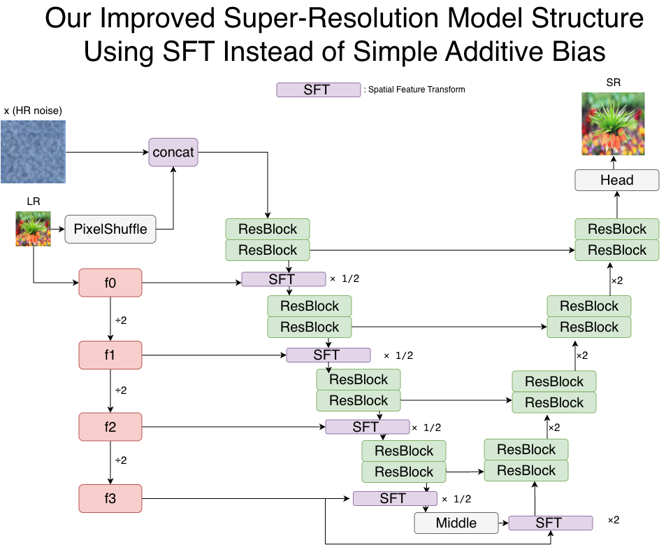

# IDDPM-Based Image Super-Resolution

Authors: Shengyun Zhong, Zesong Guo  
Course: EECE 7398 – Machine Learning with Small Data (Fall 2025), Northeastern University

---

## 1. Model Architecture

We build on OpenAI's improved-diffusion repo and extend the SR branch with:

- Learnable PixelShuffle upsampler
- Multi-scale LR condition encoder
- Spatial Feature Transform (SFT) modulation at multiple U-Net levels

Architecture overview:

  

---

## 2. Environment Setup

Tested on:

- Python 3.x
- PyTorch 2.1.0 + CUDA 11.8
- TorchVision 0.16.0

We provide:

- `environment.yml`  (conda)
- `requirements.txt` (pip)

### 2.1 Conda (recommended)

Create the environment and activate:

    conda env create -f environment.yml
    conda activate iddpm    # or the name defined inside environment.yml

If that fails, you can manually create an env and then install PyTorch + deps:

    conda create -n iddpm_sr python=3.10
    conda activate iddpm_sr

    # Install PyTorch (adjust CUDA version if needed)
    conda install pytorch==2.1.0 torchvision==0.16.0 pytorch-cuda=11.8 -c pytorch -c nvidia

    # Install remaining Python packages
    pip install -r requirements.txt

### 2.2 Pure pip

Without conda, you can do:

    python -m venv venv
    source venv/bin/activate         
    pip install -r requirements.txt

Make sure to install a compatible PyTorch wheel from https://pytorch.org/ if you want GPU support.

---

## 3. Data Preparation (DIV2K)

We use DIV2K for 4× SR (LR 128×128 → HR 512×512).

Expected layout (you can change in the config):

    data/
      DIV2K/
        HR/
          train/
          valid/
        LR/
          train/X4
          valid/X4

In `configs/sr_div2k_x4.yaml` set:

- `data_dir`        → HR train (e.g. ./data/DIV2K/HR/train)
- `lr_data_dir`     → LR train (e.g. ./data/DIV2K/LR/train/X4)
- `val_data_dir`    → HR valid
- `val_lr_data_dir` → LR valid

---

## 4. Training Scripts

We provide two entry points:

- Baseline IDDPM SR: `scripts/super_res_train_original.py`
- Improved SR (ours): `scripts/super_res_train_improved.py`

Both use the same config file, e.g. `configs/sr_div2k_x4.yaml`.

### 4.1 Train baseline IDDPM SR

    python scripts/super_res_train_original.py \
        --config configs/sr_div2k_x4.yaml

### 4.2 Train improved SR model (ours)

    python scripts/super_res_train_improved.py \
        --config configs/sr_div2k_x4.yaml

Training logs and metrics (PSNR, SSIM, LPIPS, NIQE, CLIPIQA, MUSIQ, PI) are written to:

    sr_runs/
      div2k_x4_original/
      div2k_x4_MSFI/
      div2k_x4_MFSI_SFT/

---

## 5. Pretrained Checkpoints

We provide pretrained EMA checkpoints on DIV2K for quick testing.

Download from Google Drive:

    https://drive.google.com/xxxxxxxxxxxxxxxx      <-- REPLACE with your real link

Example usage (improved model):

    python scripts/sr_infer_improved.py \
        --config configs/sr_div2k_x4.yaml \
        --model_path path/to/downloaded_ema_checkpoint.pt \
        --input path/to/lr.png \
        --output path/to/sr_improved.png

Baseline inference is analogous u

## 6. Inference Images
### 6.1 Inference Images with IDDPM SR

    python scripts/sr_infer.py \
        --config configs/sr_div2k_x4.yaml \
        --model_path .pt \ # IDDPM SR pt Path
        --lr_dir data/DIV2K/LR/valid/X4 \
        --out_dir ./results \ # Your output path
        --num_images 30 # 0 means all images in the folder

### 6.2 Inference Images with SR model (ours)

    python scripts/sr_infer_improved.py \
        --config configs/sr_div2k_x4.yaml \
        --model_path .pt \ # Our SR model pt Path
        --lr_dir data/DIV2K/LR/valid/X4 \
        --out_dir ./results \ # Your output path
        --num_images 30 # 0 means all images in the folder
